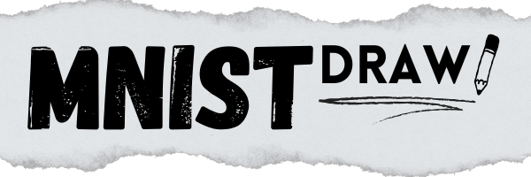

[](https://huggingface.co/spaces/gabriel-rocha/MNIST-Draw)


## About The Project


This Gradio demo allows users to interactively draw digits and instantly classify them using a pre-trained model based on the MNIST dataset. 

MNIST, a widely used dataset in the field of machine learning, consists of handwritten digits ranging from 0 to 9. A Deep Neural Network (DNN) was trained on those images with the task of classifying and recognizing previously unseen handwritings of digits.

As the scope of this project is only a demonstration, the architecture used for the model is quite simple and light-weight, with low inference time. If you wish to see better, more accurate models for the MNIST problem, consider checking out the current State-of-the-Art on [Papers With Code](https://paperswithcode.com/sota/image-classification-on-mnist?metric=Accuracy). 


## Installation


To run the project locally, follow these steps:

1. Clone the repo
   ```sh
   git clone https://github.com/gabriel-rch/MNIST-Draw.git
   ```
2. Install Python (3.11) dependencies.
   ```sh
   pip install -r requirements.txt
   ```
3. Navigate to the `app` folder
   ```sh
   cd app
   ```
4. Run the Gradio demo
   ```sh
   gradio app.py
   ```

This demo is also available on Hugging Face Spaces. You can access it [here](https://huggingface.co/spaces/gabriel-rocha/MNIST-Draw).

## Usage

Quite simply, just start drawing and see the predictions! The model will classify the digit you drew and display the result on the screen.


## Contributing

Any contributions you make are **greatly appreciated**.

If you have a suggestion that would make this better, please fork the repo and create a pull request. You can also simply open an issue with the tag "enhancement".
Don't forget to give the project a star! Thanks again!

1. Fork the Project
2. Create your Feature Branch (`git checkout -b feature/AmazingFeature`)
3. Commit your Changes (`git commit -m 'Add some AmazingFeature'`)
4. Push to the Branch (`git push origin feature/AmazingFeature`)
5. Open a Pull Request

## License

Distributed under the Apache 2.0 License. See `LICENSE` for more information.